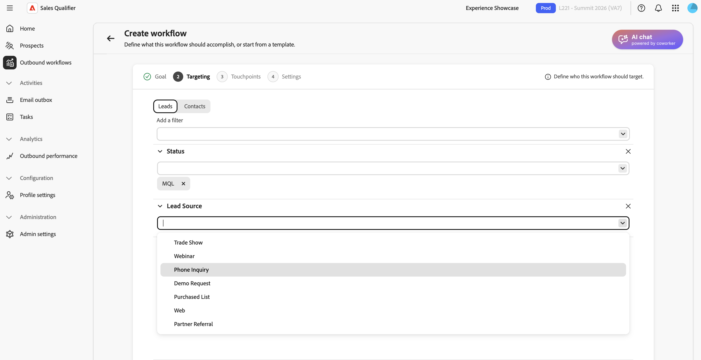

# アウトバウンドワークフロー

アウトバウンドワークフローは、目標主導型のアウトリーチケイデンスです。 目標とターゲティング基準を定義します。 そして、AIがマルチタッチケイデンスを提案し、見込み客一人ひとりにパーソナライズされたメールコンテンツを作成します。 ケイデンスをアクティブ化する前に、各メールを確認して承認します。

アウトバウンドワークフローは、次の4つの要素を結び付けます。

* **目標** - ディスカバリーコールの予約やイベント登録の増加など、アウトリーチに必要な成果。
* **ターゲティングフィルター** – どの見込み客が適格かを決定する条件。
* **タッチポイントのケイデンス**：電子メール、電話、LinkedIn InMailの各手順の順序。
* **パーソナライズされたメールコンテンツ** – 見込み客プロファイル、アカウントコンテキスト、エンゲージメント履歴、最近のニュースに基づいてAIが生成したコンテンツ。

AIは目標を活用して、ターゲティングフィルターの提案、ケイデンスの設計、タッチポイントプロンプトのドラフト、生成されるあらゆるメールのパーソナライズを行います。

## 主要概念

| 概念 | 説明 |
| --- | --- |
| **アウトバウンドワークフロー** | 目標、ターゲティングフィルター、ケイデンス、設定によって定義された、再利用可能なアウトバウンドアクティビティ。 |
| **目標** | アウトリーチで達成すべきこと。 |
| **タッチポイント** | 登録に関連してスケジュールされた、ケイデンスの1つのステップ（電子メール、電話、LinkedInMail）。 |
| **タッチポイントプロンプト** | AIが、見込み顧客の電子メールの件名と本文を生成する際に、トーン、長さ、フォーカス、call to actionなどの指示に従います。 |
| **ケイデンス** | タッチポイントの完全なシーケンス：何個、どの順序、どの日に。 |
| **ターゲティングフィルター** | アウトバウンドワークフローを見込み客のサブセットに制限する条件。 |
| **ドラフト** | レビューの準備ができているものの承認されていない生成メール。 |
| **理由** | AIが使用したシグナルやデータソースなど、特定のメールの作成方法を説明します。 |
| **登録** | 見込み客のドラフトを承認する。これにより、ケイデンスがアクティブになり、アウトバウンドワークフローの送信ウィンドウで送信するメールをキューに入れる。 |

次のセクションでは、アウトバウンドワークフローの作成、生成されたメールのレビュー、見込み客の承認、アウトバウンドワークフローの管理方法について説明します。

## アウトバウンドワークフローの作成

アウトバウンドワークフローウィザードには、**[!UICONTROL 目標]**、**[!UICONTROL ターゲット]**、**[!UICONTROL 顧客接点の生成]**、**[!UICONTROL 設定]**、**[!UICONTROL 見込み客の追加]**&#x200B;の5つのステップがあります。 目標が残りのステップを形成します。

1. 左側のナビゲーションで、**[!UICONTROL アウトバウンドワークフロー]**&#x200B;を選択します。
1. **[!UICONTROL 参照]** タブで、右上隅の「**[!UICONTROL + アウトバウンドワークフローを作成]**」を選択します。

### ステップ 1：目標の設定

この目標は、意図する成果を定義し、ターゲティング、頻度、メール生成の指針となります。

1. 独自の目標を作成するには、**[!UICONTROL 最初から開始]**&#x200B;を選択するか、保存したテンプレートを使用するには、**[!UICONTROL テンプレートから開始]**&#x200B;を選択します。

1. 会社に一致する&#x200B;**[!UICONTROL おすすめ目標]**&#x200B;のいずれかを選択します。 各レコメンデーションには、それが適合する理由を短く説明しています。 目標を入力するレコメンデーションを選択し、**[!UICONTROL すべてを表示]**&#x200B;を選択してレコメンデーションの完全なセットを参照するか、独自の目標を入力します。 また、**[!UICONTROL 人気の目標]** リストから選択することもできます。
1. 「**[!UICONTROL 次へ：ターゲティング]**」を選択します。

目標に具体的な成果を記載する。 例えば、`Promote campaign automation`ではなく`Book a 15-minute discovery call with marketing leaders evaluating campaign automation`と入力します。

### 手順2：ターゲティングフィルターの設定

ターゲティングフィルターで適格な見込み客を定義。 後で見込み客を追加すると、これらのフィルターに一致する見込み客のみが選択リストに表示されます。

{width="800" zoomable="yes"}

1. 下向き矢印を選択して&#x200B;**[!UICONTROL フィルターを追加]** リストを開き、フィルターを選択します。

1. フィルターの値を設定します。
1. オーディエンスを絞り込む必要がある場合は、さらにフィルターを追加します。

1. 「**[!UICONTROL 次へ：顧客接点を生成]**」を選択します。

### ステップ 3：顧客接点の生成とレビュー

ターゲティングを設定すると、AIが目標とターゲティング基準を分析し、ケイデンスを定義して、各顧客接点にプロンプトを書き込みます。 ケイデンスには、電子メール、電話、LinkedIn InMailのステップなどが含まれます。

{width="800" zoomable="yes"}

メールのタッチポイントを拡大し、プロンプトを読む。 プロンプトは、トーン、長さ、焦点、call to actionなど、各見込み客のメールを作成する際のAIの指針となります。

スラッシュ `/`を入力すると、メールのパーソナライズに使用できる定義済みトークンのリストが表示されます。

#### ケイデンスの再生成

ケイデンスが目的と異なる場合は、**[!UICONTROL 再生成]**&#x200B;を選択し、絞り込み命令を入力します。 例：

* `Use three touchpoints across two weeks`
* `Lead with an executive briefing offer in the first email`
* `Add a nurture touch focused on a relevant case study`

AIは、命令に基づいてケイデンス全体を書き換えます。 ひとつのメールタッチポイントを調整するには、ケイデンス全体を再生成するのではなく、そのプロンプトを編集します。

タッチポイントの遅延時間を数日、時間、分で設定します。 前のタッチポイントの登録後または完了後に待機せずにタッチポイントを送信するには、日、時間、分を`0`に設定します。 より長い遅延を使用して、ケイデンス内の後のタッチポイントを配置します。

#### プロンプトでのナレッジセンターの使用

組織が[&#x200B; ナレッジセンター](knowledge-center.md) プレイブックを構築している場合は、プロンプトでそのプレイブックを参照してください。 ドキュメントに名前を付け、使用するコンテキストを記述します。 例えば、`Use the ABC positioning guide from the Knowledge Center and focus on the security value proposition`と入力します。

ケイデンスとプロンプトの準備ができたら、**[!UICONTROL 次へ：設定]**&#x200B;を選択します。

見込み顧客のメールを生成する前に、タッチポイントのプロンプトを調整します。 AIは、選択された見込み客ごとに、これらのプロンプトを使用します。

### 手順4：アウトバウンドワークフロー設定の設定

**[!UICONTROL 設定]** ステップは、アウトバウンドワークフローの実行方法を制御します。

{width="800" zoomable="yes"}

1. **[!UICONTROL 送信ワークフロー名]**&#x200B;を確認し、必要に応じて変更します。
1. アウトバウンドワークフローごとに&#x200B;**[!UICONTROL 最大プロスペクト数]**&#x200B;で、アウトバウンドワークフローが一度に管理できるプロスペクトの最大数を確認します。
1. 送信メールの送信が許可されている時間に&#x200B;**[!UICONTROL 送信ウィンドウ]**&#x200B;を設定します。
1. メールを送信できる曜日を選択します。 週末の送信を避けるには、別の&#x200B;**[!UICONTROL 週末をスキップ]**&#x200B;設定を使用する代わりに、週末のみを選択します。
1. 各見込み客の最もアクティブな時間帯に配信するかどうかを選択します。
1. 見込客がミーティングを予約した後、フォローアップの顧客接点を自動的に停止するには、**[!UICONTROL ミーティング予約の一時停止]**&#x200B;をオンにします。
1. 各見込み客のタイムゾーンまたは送信ワークフロー&#x200B;**[!UICONTROL タイムゾーン]**&#x200B;を送信タイミングに使用するかどうかを選択します。 アウトバウンドワークフローのタイムゾーンを使用する場合は、オーディエンスと一致することを確認します。
1. **[!UICONTROL 権限]**&#x200B;で、**[!UICONTROL プライベート]** （デフォルト）を維持するか、**[!UICONTROL 全員と共有]**&#x200B;を選択します。 詳しくは、[&#x200B; アウトバウンドワークフローの共有](#share-an-outbound-workflow)を参照してください。
1. **[!UICONTROL 見込み客を保存して追加]**&#x200B;を選択します。

オプトアウトフッターは、管理者によってグローバルに設定され、アウトバウンドワークフロー設定とは独立してアウトバウンドメールに適用されます。 「[&#x200B; グローバル電子メールオプトアウトの設定](integrations.md#configure-global-email-opt-out)」を参照してください。

### ステップ 5：見込み客を追加し、メール生成を開始する

保存すると、手順2のターゲティングフィルターが適用された見込み客の選択ビューが開きます。

1. リストを確認します。

   行には、通常、見込み客の名前、アカウント、電子メール、役職、エンゲージメントステータス、見込み客ステータスが含まれます。

1. リストを拡大または絞り込む必要がある場合は、ここでフィルターを調整します。
1. チェックボックスを使用して見込み客を選択します。
1. 「**[!UICONTROL 次へ：顧客接点]**&#x200B;を確認して、見込み客ごとのメール生成を開始する」を選択します。

AIは、選択した見込み客とメールの顧客接点ごとにパーソナライズされたメールを生成します。 電話とLinkedIn InMailの顧客接点は、スケジュールされた手順のままです。 生成中に作業を続けるには、**[!UICONTROL 準備ができたら通知]**&#x200B;を選択します。

見込み客ごとに、AIはタッチポイントプロンプトと、個人およびアカウントのデータ、エンゲージメント履歴、最近のニュースを組み合わせて、件名と本文を生成します。

## 生成されたメールのレビューと調整

生成が完了すると、アウトバウンドワークフローの詳細ビューでドラフトのレビューを求めるメッセージが表示されます。 Sales Qualifierでは、承認するまで電子メールは配信されません。

1. アウトバウンドワークフローの詳細ビューで、バナーの「**[!UICONTROL 下書きを確認]**」を選択します。
1. **[!UICONTROL タッチポイントのレビュー]** ステップには、次の2つのタブがあります。
   * **[!UICONTROL レビューの準備完了]** – 電子メールの生成が完了しました。
   * **[!UICONTROL 生成中]** – まだ書き込み中のメール。
1. 左側の見込み客リストで、名前を選択して、右側にその見込み客のタッチポイントを読み込みます。
1. タッチポイントで山形（**>**）を使用して、件名と本文を展開して読み上げます。

### AIの推論を読む

生成された各電子メールについて、**[!UICONTROL 推論]**&#x200B;は、AIがメッセージをどのように作成したかを説明しています。これには、コンテンツとcall to actionを形作ったシグナル、属性、ソースが含まれます。 承認する前に、この情報を確認し、パーソナライゼーションを検証してください。

### メールを直接編集

小さな文言やトーンの変更の場合：

1. 拡張されたタッチポイントで、**[!UICONTROL 編集]** アイコンを選択してエディターを開きます。
1. 件名または本文を編集します。
1. 「**[!UICONTROL 保存]**」を選択します。

### AIを活用して電子メールを調整

構造または強調の変更については、**[!UICONTROL AIによる生成]**&#x200B;を使用してください。 パーソナライゼーションのコンテキストを維持しながら、AIがメールを書き換えます。

1. メールエディターで、**[!UICONTROL AIで生成]**&#x200B;を選択します。

1. 明確な指示を入力します。例：
   * `Make it shorter and more direct. Keep it under 100 words.`
   * `Focus more on the prospect's role and how the solution helps them specifically.`
   * `Change the call-to-action to suggest a 15-minute introductory call instead.`
1. リビジョンを確認し、必要に応じて編集します。
1. 「**[!UICONTROL 保存]**」を選択します。

>[!TIP]
>
>文言やトーンの変更には、直接編集を使用します。 AI **で**&#x200B;生成を使用してメールを書き換えます。

## 見込み客の承認と登録

承認は、見込み顧客のケイデンスをアクティブ化します。 承認して登録するまで、システムは見込み客にメールを送信しません。

1. 左側の見込み客リストで、メールを確認し、送信する準備ができている見込み客を選択します。
1. 右下隅の「**[!UICONTROL 承認して見込み客]**」を選択します。

承認された電子メールは、アウトバウンドワークフローで選択した日数、送信ウィンドウ、アクティブ時間オプション、タイムゾーン設定に従って送信されます。 遅延がゼロのタッチポイントは待機なしで送信し、他のタッチポイントは設定された遅延に従います。 未承認の見込み客は&#x200B;**[!UICONTROL レビューの準備完了]**&#x200B;のままです。

## アウトバウンドワークフローの共有

各アウトバウンドワークフローには、**[!UICONTROL 権限]**&#x200B;の設定があります。 アウトバウンドワークフローは、デフォルトで&#x200B;**[!UICONTROL プライベート]**&#x200B;です。 所有者は、**[!UICONTROL 全員と共有]**&#x200B;を選択して、チームでアウトバウンドワークフローを利用できるようにすることができます。

>[!CAUTION]
>
>共有は永続的です。 アウトバウンドワークフローを&#x200B;**[!UICONTROL 全員と共有]**&#x200B;に設定した後、それを&#x200B;**[!UICONTROL プライベート]**&#x200B;に変更することはできません。

共有されたアウトバウンドワークフローでは、チームメイトが自分の見込み客を登録できます。 一括アクションの使用時も含め、各自が登録した見込み客のみを管理または一時停止できます。 アウトバウンドワークフローの所有者だけでも、スケジュール、タイムゾーン、ケイデンスなどのプランレベルの設定を編集できます。 これらの設定はチームメイトに対して読み取り専用です。

共有されたアウトバウンドワークフローと結果の焦点を絞り込むには、次のフィルターを使用します。

* **[!UICONTROL エンゲージメント済みの見込み客]**&#x200B;および&#x200B;**[!UICONTROL パフォーマンス]**&#x200B;で、**[!UICONTROL 登録者]**&#x200B;を使用して、見込み客を登録した人物でフィルタリングします。 フィルターは、登録した見込み客にデフォルトで適用されます。
* **[!UICONTROL 参照]** タブで、共有フィルターを使用して、**[!UICONTROL 自分で共有]**、**[!UICONTROL 自分と共有]**、**[!UICONTROL プライベート]**、または&#x200B;**[!UICONTROL すべて]**&#x200B;を選択します。

## 不在返信の処理

見込み客が不在メッセージで応答すると、アウトバウンドワークフローが自動的に処理します。

* **自動再開**: デフォルトではオンです。 不在返信に返信日が含まれる場合、アウトバウンドワークフローはその日にケイデンスを再開します。 返信日が指定されていない場合、チームが設定できる再開後のバッファーの後に、アウトバウンドワークフローが再開されます。
* **手動オプション**：担当者は引き続き&#x200B;**[!UICONTROL 今すぐ再開]**&#x200B;を選択するか、特定の再開日をスケジュールできます。 [既存のアウトバウンドワークフローの管理](#manage-existing-outbound-workflows)を参照してください。

## 既存のアウトバウンドワークフローの管理

**[!UICONTROL アウトバウンドワークフロー]** ページの「**[!UICONTROL 参照]**」タブには、使用可能なすべてのアウトバウンドワークフローが一覧表示されます。 各カードには、目標、設定されたタッチポイント、パフォーマンス指標が表示されます。 このビューは、アウトバウンドワークフローのモニタリング、ドラフトのレビュー、見込み客の追加に使用できます。

## 電子メールの受信トレイ

[電子メール送信](email-outbox.md)には、自動送信された電子メールと返信が一覧表示されます。

## ミーティング予約

カレンダーを接続すると、Sales Qualifierに個人の予約リンクが生成され、見込み客はカレンダーを使用して時間を予約できます。

* **予約リンク**-[&#x200B; プロファイル設定](profile-settings.md)でカレンダー接続と利用状況を設定します。 予約リンクを電子メール署名に追加して、アウトバウンドメールに表示されるようにします。
* **ケイデンスの配置** - Sales Qualifierは、関連するポイントに予約リンクをケイデンスで挿入します。 配置を変更することもできます。
* **予約の一時停止** – 見込み客が会議を予約すると、**[!UICONTROL 会議の予約の一時停止]**&#x200B;がさらにフォローアップを停止します。 [手順4：送信ワークフロー設定](#step-4-configure-outbound-workflow-settings)を参照してください。

[&#x200B; アウトバウンドパフォーマンス &#x200B;](performance.md) ページで予約結果を追跡します。

## アウトバウンドワークフローのベストプラクティス

* **特定の目標を定義します。** ターゲティング、ケイデンス、電子メールはすべて、目標から生まれています。 アウトバウンドワークフローで達成する結果を記述します。
* **見込み客ごとの生成の前に、タッチポイントのプロンプトを最終決定します。** 一括生成後、通常、一度にひとつの見込み客に変更を加えます。
* **推論を品質チェックとして使用します。** 誤ったシグナルが強調されたり、関連するシグナルが欠けていたりする場合は、電子メールを編集するか、タッチポイントプロンプトを修正して、ケイデンスを再生成します。
* **編集ツールを変更と一致させます。** 文言やトーンに直接編集を使用したり、 再構築またはリフレームにAI **を使用して**&#x200B;生成します。
* **レビューしたものだけを承認してください。** 顧客接点を拡大し、コンテンツを読み、登録する前に必要に応じて調整します。

>[!MORELIKETHIS]
>
>* [タスク](tasks.md)
>* [&#x200B; ナレッジセンター](knowledge-center.md)
>* [&#x200B; アウトバウンドパフォーマンス &#x200B;](performance.md)
